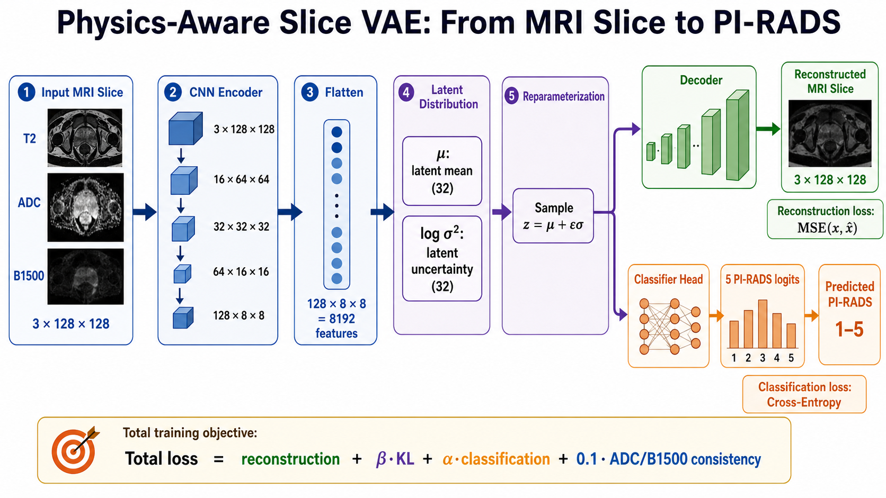

# Prostate MRI PI-RADS Predictor

Built for **Uncommon Hacks 2026** — **Social Impact Track**.

**Live app:** https://huggingface.co/spaces/sabyachow/prostate-pirads-vae
**Youtube link** https://youtu.be/KXggjb2rBts

This project is a research prototype that looks at prostate scan images and estimates how suspicious the scan appears for clinically important prostate cancer.

In simple terms:

```text
upload prostate scan images -> model reviews the slices -> app returns a PI-RADS-style risk score
```

The goal is not to replace doctors. The goal is to explore whether AI can help make prostate MRI review faster, more consistent, and easier to explain.



## Devpost Short Pitch

Many prostate biopsies happen because scans look suspicious, but many do not find clinically serious cancer. Our project uses AI to review prostate MRI slices and produce a PI-RADS-style risk score, highlighting the slice that looks most suspicious and giving clinicians a clearer triage signal before invasive follow-up.

## Team

- Sabyasachi Chowdhury — sabyasachic@uchicago.edu
- Sameeksha Kini — sameekshakini@uchicago.edu
- Jenitha Patel — jenithapatel@uchicago.edu
- Akshaj Chandwani — akshajchandwani@uchicago.edu

## Problem Statement

Prostate cancer screening often starts with a blood test called **PSA**. If PSA is high, the patient may be sent for a prostate scan and sometimes for a biopsy.

A **biopsy** means taking small tissue samples from the prostate with a needle. It can be painful, stressful, expensive, and it carries medical risks. The difficult part is that many biopsies do not find dangerous cancer. Some happen because the scan looks suspicious even though the tissue is not clinically serious.

The VERDICT MRI study by Singh et al. (2022) reported that prostate MRI can still create a large false-positive burden. In everyday language, this means:

```text
many scans look worrying,
but many of those cases do not become serious cancer findings after biopsy.
```

That is the problem our project focuses on: can we build a tool that helps summarize prostate scan risk more consistently before a patient goes through invasive follow-up?

## Social Impact Track Fit

This project fits the **Social Impact** track because it targets a real healthcare friction point: unnecessary invasive procedures caused by uncertainty in screening.

Potential impact:

- Reduce avoidable biopsy burden by making MRI risk review more consistent.
- Help patients and clinicians understand which scan slices are driving concern.
- Support hospitals or clinics with limited access to prostate MRI specialists.
- Encourage responsible medical AI by showing confidence, slice-level evidence, and clear disclaimers instead of pretending to make a diagnosis.

The social impact is not that the model makes final medical decisions. The impact is that tools like this could support safer triage, clearer communication, and better use of specialist time.

## Our Idea

Our app studies multiple views of a prostate scan and predicts a **PI-RADS-style score**.

**PI-RADS** is a 1-to-5 scoring system used by radiologists to describe how suspicious a prostate MRI looks:

```text
PI-RADS 1 = very unlikely to be clinically important cancer
PI-RADS 2 = unlikely
PI-RADS 3 = uncertain / borderline
PI-RADS 4 = likely
PI-RADS 5 = very likely
```

The model reviews the scan slice by slice, finds the slice that looks most suspicious, and reports a patient-level prediction.

## What Is MRI?

**MRI** stands for **Magnetic Resonance Imaging**. It is a medical scan that uses magnets and radio waves to create pictures inside the body. For prostate cancer screening, MRI can show the shape of the prostate and highlight areas where tissue behaves abnormally.

One MRI exam is not just one picture. It is usually a stack of many image slices, like pages in a book.

This project uses three kinds of prostate MRI images:

- **T2 image**: shows the prostate anatomy clearly. Think of it as the structural view.
- **ADC image**: shows how freely water moves through tissue. Cancerous or dense tissue may restrict water movement.
- **BVAL/B1500 image**: another diffusion-based view that can make suspicious areas stand out more strongly.

The app combines these three image types so the model can look at both anatomy and tissue behavior.

## What We Built During The Hackathon

We built a working end-to-end prototype:

- A **Gradio web app** where a user can upload prostate MRI files.
- A preprocessing pipeline that groups matching scan slices from the uploaded files.
- A machine learning model that predicts PI-RADS probabilities for each slice.
- A patient-level summary that selects the highest-risk slice.
- A probability table and slice-level output so the prediction is not just a black box.
- A data disclosure and safety note explaining that the tool is research-only.

## Why This Matters

Reading prostate MRI well requires expert radiology experience. In real healthcare settings, that creates three practical challenges:

- **Unnecessary biopsies**: false alarms can lead to invasive procedures.
- **Different opinions**: two readers may not score the same scan exactly the same way.
- **Limited access**: not every hospital has many prostate MRI specialists.

Our prototype explores whether a machine learning model can provide a consistent second opinion by turning prostate MRI slices into PI-RADS risk probabilities.

## What The App Does

The app expects prostate scan files containing three matching image types:

```text
AX_T2
AX_DIFFUSION_ADC
AX_DIFFUSION_CALC_BVAL / B1500
```

The app then:

1. Reads the uploaded scan files.
2. Groups matching T2, ADC, and BVAL/B1500 slices.
3. Converts each group into a standard image format for the model.
4. Predicts the probability of PI-RADS 1, 2, 3, 4, and 5 for each slice.
5. Picks the highest-risk slice.
6. Reports the final patient-level PI-RADS-style score.

Output includes:

- predicted patient PI-RADS score
- model confidence
- selected highest-risk slice
- class probability table
- slice-level summary table

## Demo Flow

For judging or demo purposes:

1. Open the app.
2. Upload a patient scan ZIP or matching image files.
3. The app identifies T2, ADC, and BVAL/B1500 scan slices.
4. The model scores every slice from PI-RADS 1 to PI-RADS 5.
5. The app selects the most suspicious slice.
6. The app displays the final patient-level PI-RADS-style score and confidence.

This is designed for a short demo: upload, analyze, explain the selected slice, then show the risk probabilities.

## Model In Plain English

The model is trained to do two things at the same time:

1. **Rebuild the MRI slice** after compressing it into a smaller internal representation.
2. **Predict the PI-RADS score** from that internal representation.

This is useful because the model is not only memorizing labels. It also has to preserve enough information to reconstruct the medical image. That encourages the internal representation to contain meaningful scan information.

Technically, this is a **variational autoencoder with a classifier head**:

```text
MRI slice -> compressed representation -> reconstructed MRI slice
                                |
                                -> PI-RADS prediction
```

The classifier uses the stable center of the compressed representation, while the reconstruction branch helps regularize the model.

## Project Layout

```text
.
├── app/
│   ├── app.py                  # Gradio entry point
│   ├── core/                   # preprocessing, model loading, prediction logic
│   ├── model/                  # trained checkpoint and training history
│   └── sample_uploads/         # upload format notes
├── data/
│   └── README.md               # data access notes; raw NYU fastMRI data excluded
├── notebooks/
│   └── prostrate_fastMRI_VAE.ipynb
├── src/
│   └── prostate_pirads_model.py
├── requirements.txt
└── .gitignore
```

## Run The Gradio App

From this project folder:

```bash
pip install -r requirements.txt
python app/app.py
```

Then open the local Gradio URL printed in the terminal.

For Hugging Face Spaces, the repository also includes a root-level `app.py` wrapper. Spaces can run that directly.

## Deploy On Hugging Face Spaces

1. Create a Hugging Face account.
2. Go to `https://huggingface.co/new-space`.
3. Create a new Space with:
   - SDK: `Gradio`
   - Hardware: CPU basic is enough for the demo
   - Visibility: Public or Private
4. Upload or push this repository to the Space.

Hugging Face Spaces will install `requirements.txt` and run the root `app.py`.

Do not upload real NYU fastMRI data to the Space. Use the included synthetic ZIP only for interface testing.

## Upload Format

Upload either a ZIP file or multiple files where folders, filenames, or DICOM metadata contain sequence names:

```text
patient_001/
  AX_T2/
  AX_DIFFUSION_ADC/
  AX_DIFFUSION_CALC_BVAL/
```

PNG/JPG/TIFF files can be used for a quick demo if their filenames include `T2`, `ADC`, and `BVAL` or `B1500`.

For a safe test upload, use:

```text
app/sample_uploads/synthetic_patient_demo.zip
```

This sample is synthetic and only checks the app workflow. It is not real patient data and has no clinical meaning.

## Technical Model Summary

For readers who want the implementation details: the model is a convolutional variational autoencoder with a deterministic PI-RADS classifier.

```text
3-channel MRI slice
  -> CNN encoder
  -> latent distribution: mu, logvar
  -> sampled z for image reconstruction
  -> mu for stable PI-RADS classification
```

The loss combines:

- image reconstruction loss
- KL regularization on the latent distribution
- PI-RADS classification loss
- a small ADC/B1500 consistency penalty

In plainer language, the model is rewarded when it:

- reconstructs the scan slice well
- predicts the correct PI-RADS label
- keeps its compressed representation smooth and stable
- keeps the diffusion-related image channels internally consistent

## Responsible AI Notes

Because this is a medical AI prototype, the app is deliberately framed as decision support, not diagnosis.

Responsible-use choices:

- The app reports confidence and probability tables instead of only one hard label.
- It shows the selected slice so the user can see what drove the patient-level score.
- Raw medical data from NYU fastMRI is not redistributed in this repository.
- The README and app state that this is not for clinical use.
- The project is intended for research, education, and hackathon demonstration only.

## Data Source And Disclosure

This project uses the **NYU fastMRI prostate MRI dataset**:

```text
https://fastmri.med.nyu.edu/
```

The fastMRI prostate data contains prostate MRI exams acquired on 3T scanners, including axial T2-weighted and diffusion-weighted imaging. Access requires accepting the NYU fastMRI Dataset Sharing Agreement.

Important disclosure:

- Raw fastMRI data is **not included** in this repository.
- Dataset files, download links, and derived patient-level data should not be redistributed through this repository.
- Anyone who wants to reproduce training should apply for fastMRI access individually through NYU and follow the fastMRI Dataset Sharing Agreement.
- This project is for research/educational hackathon use only.

Suggested acknowledgement:

```text
Data used in this project were obtained from the NYU fastMRI Initiative database (https://fastmri.med.nyu.edu/).
```

## Disclaimer

This is a research and educational prototype only. It is not a diagnostic medical device and must not be used for clinical decision-making.
